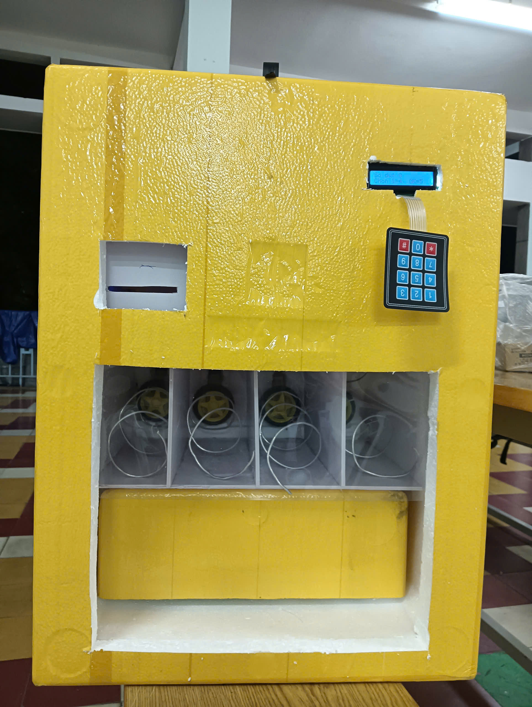
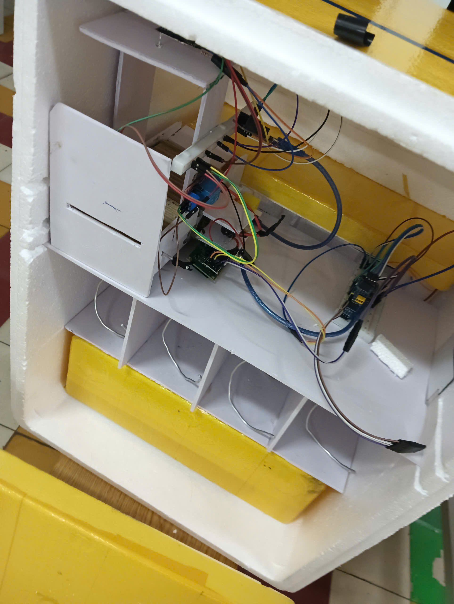

# Smart Vending Machine – Embedded IoT System

## Overview
An intelligent vending machine system integrating **Embedded IoT, AI-based image recognition, and Backend Server**.

This repository focuses on the **IoT & Embedded System**, which was **fully designed and implemented by me** in a 4-member team project.

The system is built around **ESP8266 and ESP32-CAM**, handling real hardware control, sensors, actuators, and server communication.

---

## My Role – IoT / Embedded Engineer
I was fully responsible for the **IoT subsystem**, including:

- Designing IoT hardware architecture
- Developing firmware for **ESP8266 (Master Controller)** and **ESP32-CAM**
- Designing communication flow between ESP32-CAM ↔ Server ↔ ESP8266
- Integrating and controlling sensors and actuators:
  - IR sensor, relay modules, DC motors
  - I2C LCD, I2C keypad (PCF8574)
  - External LED lighting
- Handling real-time constraints, state machine logic, and hardware debugging

---

## System Architecture
- **ESP32-CAM**
  - Detects banknote via IR sensor
  - Controls LED lighting and captures banknote image
  - Sends JPEG image to AI server
  - Controls money intake motor via relay

- **ESP8266 (Master Controller)**
  - Connects to Wi-Fi and backend server
  - Receives money recognition result
  - Manages user interaction (LCD + Keypad)
  - Controls water dispensing via relay & DC motor
  - Implements vending logic using a state machine

---

## System Demo & Hardware Overview

▶️ **Full System Operation**  
https://drive.google.com/file/d/1hUNdlhcGtkNUudN2bkwDZh0s49zR9ByX/view?usp=sharing

▶️ **Money Intake Mechanism Test**  
https://drive.google.com/file/d/1mCVCybgOZBQyTyvJJvL7Q4WHzWrlBX2U/view?usp=sharing

### Device Overview
**Exterior view:**  

**Internal hardware & wiring:**  

> Internal wiring was manually designed and assembled, focusing on signal isolation, relay safety, and stable I2C communication.

---

## Hardware Used
- ESP8266, ESP32-CAM  
- IR Sensor  
- Relay Module  
- DC Motors  
- I2C LCD 16x2  
- I2C Keypad (PCF8574)  
- External LEDs  

---

## Key Technical Highlights
- Master–Slave architecture (ESP8266 ↔ ESP32-CAM)
- State machine–based control (`IDLE`, `SELECTED`, `DISPENSING`)
- Non-blocking timing using `millis()`
- I2C communication (LCD, Keypad)
- Relay isolation for motor control
- HTTP / HTTPS communication with JSON payloads

---

## Skills Demonstrated
- Embedded C/C++ (Arduino)
- ESP8266 & ESP32-CAM firmware development
- GPIO, I2C, Relay, Motor control
- Real hardware debugging
- State machine and timing design
- IoT system integration

---

## Notes
AI and Backend Server modules were developed by other team members.  
This repository highlights **Embedded IoT system design and implementation**.
